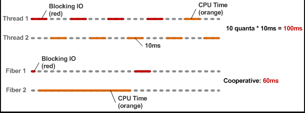
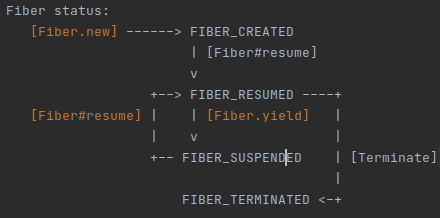

# Fibers on Ruby

Las fibras son estructuras que implementan un mecanismo de concurrencia cooperativa y liviana en Ruby. Básicamente, son un medio para crear bloques de código que se pueden pausar y reanudar, al igual que los hilos. La principal diferencia es que nunca se planifican implicitamente y que la programación debe realizarla el programador y no la VM. 

O sea que en el caso de los `threads`, el scheduler se encarga de la planificacion y de 

A diferencia de otros modelos de concurrencia ligeros sin stack, cada `fiber` viene con un stack. Esto permite que el fiber se pause desde llamadas de función anidadas dentro del bloque del `Fiber`.

Al ser un esquema colaborativo, nos da un mayor control de la ejecucion, y es mas, proporcionan un control total al programador sore su ejecucion como mencionamos antes. Veamos un ejemplo de comparacion en cuanto a los tiempos..




> Nota: Desde Ruby 3.0, el concepto de los `non-blocking fibers` fue introducido.  Since Ruby 3.0, the concept of non-blocking fiber was introduced. Non-blocking fiber, when reaching any potentially blocking operation (like sleep, wait for another process, wait for I/O data to be ready), instead of just freezing itself and all execution in the thread, yields control to other fibers, and allows the scheduler to handle waiting and waking (resuming) the fiber when it can proceed.

For Fiber to behave as non-blocking, it should be created in ::new with blocking: false (which is the default now), and ::scheduler should be set with ::set_scheduler. If ::scheduler is not set in the current thread, blocking and non-blocking fiber's behavior is identical.

Ruby doesn't provide a scheduler class: it is expected to be implemented by the user and correspond to Fiber::SchedulerInterface.

### Diferencias que vemos entre los threads y fibers

> TL;DR.. 

- Los Fibers son ligeros en cuanto a la memoria que consumen y los tiempos del ciclo de vida
- Tenemos el control de los Fibers, de manera explicita, o sea que tenemos el control absoluto de su ciclo de vida y planificacion.
- Si bien con los threads tenemos al scheduler que decide cuando un thread se pausa o reanuda, en el caso de los Fibers es variante. O sea, al tener el control nosotros de la planificacion, tenemos que especificar cuando iniciar y parar la ejecucion de un Fiber.
- Los Fibers, son maneras de escribir bloques de codigo, que pueden ser pausados o resumidos, bastante parecidos a los threads, pero con la diferencia de la planificacion de nuestro lado.
- Los `Threads` se ejecutan en un segundo plano, especialmente cuando hay una interrupcion. En el caso de los Fibers, se convierten en el programa principal, cuando se ejecutan, hasta que uno los para. 

### Estados de los Fibers



### Que son los Fibers por atras??

En realidad los Fibers, en su implementacion al menos en MRI, son en suma corutinas, simples corutinas.

Incluso las mejoras que se introdujeron en Ruby 2.6 

### Sobre el tamaño del stack de Threads y Fibers  

Podemos comprobar rápidamente el tamaño de la pila para un `Thread` y para las` Fibers` en ruby ​​comprobando `RubyVM :: DEFAULT_PARAMS` en la consola irb o pry:

```ruby
pry(main)> RubyVM::DEFAULT_PARAMS
=> {:thread_vm_stack_size=>1048576,
 :thread_machine_stack_size=>1048576,
 :fiber_vm_stack_size=>131072,
 :fiber_machine_stack_size=>524288}
```

> Esto solo es valido para versiones de Ruby >= 2.0.0

Ahora podemos comprobar rápidamente el tamaño de la pila de los `hilos` tal como están

Esto muestra claramente que el tamaño de la pila para los subprocesos en ruby ​​es solo de 1 MB, mientras que el tamaño de la pila para las fibras es de solo 512k. Podemos cambiar esto haciendo una exportación de cada una de las variables, como por ejemplo:


```dotenv
export RUBY_FIBER_VM_STACK_SIZE=2097152
export RUBY_THREAD_VM_STACK_SIZE=2097152
```

Esto aumentará el tamaño de la pila y las veces que podemos llamar a una pila anidada.

Con stack size de 1MB

```ruby
$ ruby stack_size.rb 
Max Stack Level: 10079
```

Con un stack de 2MB

```ruby
altair.λ:~/utn/iasc/fibers-ruby/extras$ ruby stack_size.rb 
Max Stack Level: 20161
```

Podemos ver que es casi linea la cantidad de veces que podemos llamar al stack con el stack size que tenemos.

> Esto puede variar dependiendo de la informacion y de los datos que guardemos en el stack.